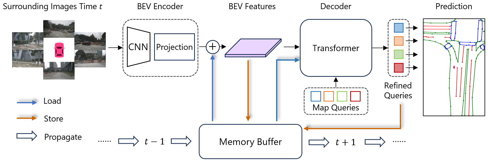

<div align="center">
  <h1>StreamMapNet</h1>
  
  <h3>[WACV 2024] StreamMapNet: Streaming Mapping Network for Vectorized Online HD Map Construction </h3>
  
  [](https://arxiv.org/abs/2308.12570)
  
  
</div>

## Introduction
This repository is an official implementation of StreamMapNet.

## Getting Started
### 1. Environment
**Step 1.** Create conda environment and activate it.

```
conda create --name streammapnet python=3.8 -y
conda activate streammapnet
```

**Step 2.** Install PyTorch.

```
pip install torch==1.9.0+cu111 torchvision==0.10.0+cu111 torchaudio==0.9.0 -f https://download.pytorch.org/whl/torch_stable.html
```

**Step 3.** Install MMCV series.

```
# Install mmcv-series
pip install mmcv-full==1.6.0
pip install mmdet==2.28.2
pip install mmsegmentation==0.30.0
git clone https://github.com/open-mmlab/mmdetection3d.git
cd mmdetection3d
git checkout v1.0.0rc6 
pip install -e .
```

**Step 4.** Install other requirements.

```
pip install -r requirements.txt
```

### 2. Data Preparation
**Step 1.** Download [NuScenes](https://www.nuscenes.org/download) dataset to `./datasets/nuScenes`.

**Step 2.** Download [Argoverse2 (sensor)](https://argoverse.github.io/user-guide/getting_started.html#download-the-datasets) dataset to `./datasets/av2`.

**Step 3.** Generate annotation files for NuScenes dataset.

```
python tools/nuscenes_converter.py --data-root ./datasets/nuScenes --newsplit
```

**Step 4.** Generate annotation files for Argoverse2 dataset.

```
python tools/argoverse_converter.py --data-root ./datasets/av2 --newsplit
```

### 3. Training and Validating
To train a model with 8 GPUs:

```
bash tools/dist_train.sh ${CONFIG} 8
```

To validate a model with 8 GPUs:

```
bash tools/dist_test.sh ${CONFIG} ${CEHCKPOINT} 8 --eval
```

To test a model's inference speed:

```
python tools/benchmark.py ${CONFIG} ${CEHCKPOINT}
```

## Results

### Results on Argoverse2 newsplit
| Range | $\mathrm{AP}_{ped}$ | $\mathrm{AP}_{div}$| $\mathrm{AP}_{bound}$ | $\mathrm{AP}$ | Config | Epoch | Checkpoint |
| :---: |   :---:  |  :---:  | :---:   |:---:|:---: |:---:  | :---:   |
| $60\times 30\ m$ | 57.9 | 55.7| 61.3| 58.3| [Config](./plugin/configs/av2_newsplit_608_60x30_30e.py) | 30 | [ckpt](https://drive.google.com/file/d/1p6PZDGbVoxedU0YqEbvSBjCMkcTx91ld/view?usp=share_link)|
| $100\times 50\ m$ |60.0 | 45.9 | 48.9 | 51.6 | [Config](./plugin/configs/av2_newsplit_608_100x0_30e.py5) |30 | [ckpt](https://drive.google.com/file/d/1PkOiGFLGyQ7GUljeRS7REQS6Cv_pV1qx/view?usp=share_link)|

### Results on NuScenes newsplit
| Range | $\mathrm{AP}_{ped}$ | $\mathrm{AP}_{div}$| $\mathrm{AP}_{bound}$ | $\mathrm{AP}$ | Config | Epoch | Checkpoint |
| :---: |   :---:  |  :---:  | :---:      |:---:|:---: |:---:   | :---:      |
| $60\times 30\ m$ | 32.2 | 29.3 | 40.8 | 34.1 | [Config](./plugin/configs/nusc_newsplit_480_60x30_24e.py) | 24| [ckpt](https://drive.google.com/file/d/1L9IRkd_Sg_hPu8SSagWBEZahUD_dvMeG/view?usp=share_link)|
| $100\times 50\ m$ | 25.6 | 17.4 | 24.3 | 22.4 | [Config](./plugin/configs/nusc_newsplit_480_100x50_24e.py)| 24 | [ckpt](https://drive.google.com/file/d/1nB4r108-rj87Ain7s8HHEo5hXvxZMMre/view?usp=share_link)|

### Results on NuScenes oldsplit
| Range | $\mathrm{AP}_{ped}$ | $\mathrm{AP}_{div}$| $\mathrm{AP}_{bound}$ | $\mathrm{AP}$ | Config | Epoch | Checkpoint |
| :---: |   :---:  |  :---:  | :---:      |:---:|:---:|:---:   | :---:      |
| $60\times 30\ m$ | 61.7| 66.3 | 62.1 | 63.4 | [Config](./plugin/configs/nusc_baseline_480_60x30_30e.py) | 30| [ckpt](https://drive.google.com/file/d/1-n6DGu23KkSO8PFfJ01ofmtUed0zOMZ_/view?usp=share_link)|

## Citation
If you find our paper or codebase useful in your research, please give us a star and cite our paper.
